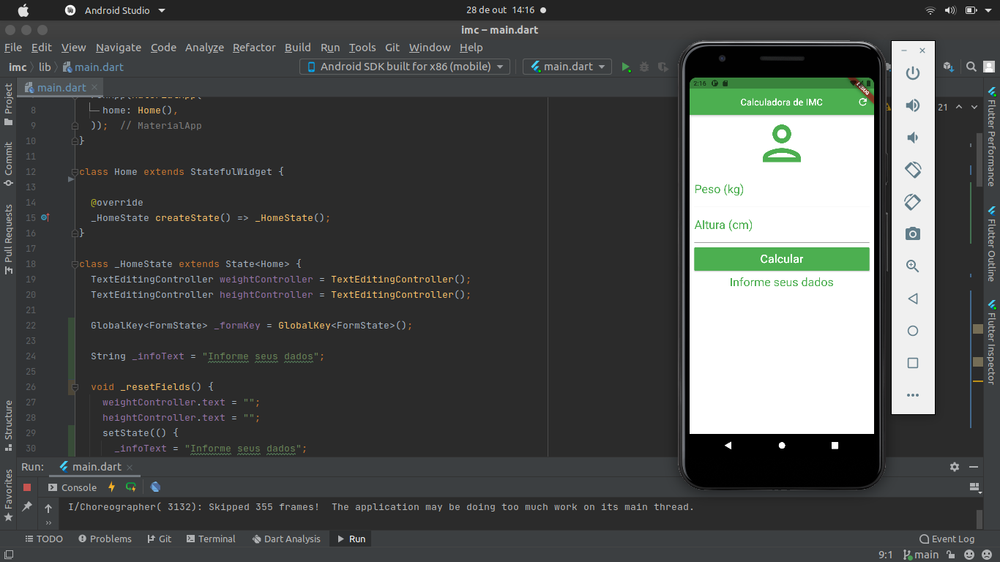

# IMC

O Índice de Massa Corporal é uma medida internacional usada para calcular se uma pessoa está no peso ideal. A aplicação, foi desenvolvida com Flutter e diz se o índividuo está com Abaixo do peso, peso ideal, levemente acima do peso, obesidade grau I,  obesidade grau II e obesidade grau III, além disso, também mostra o imc 

## Preview

<h1 align="center">
    
</h1>

## Tecnologias

- Flutter
=======
```
### IMC
- Aplicação desenvolvida, com a linguagem FLutter, para calcular o 
  Indice de Massa Corporal (IMC), que irá medir se as 
  pssoas estão no peso ideal
>>>>>>> e5574edb2a40c88880a4e1bf2cd2f61be20b78d6
